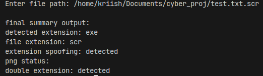

  

Sp00fSn1p3r is a tool for analyzing files, which can be used to identify disguises in files, as used in various malwares.

The tool checks for the actual type of the files based on magic number identification and compares it with the extension to identify disguises. The tool can also be used to identify double extension disguises, as well as basic structural validation for PNG.

Features:
1. Magic number-based file type detection
2. Extension vs actual type comparison
3. Double extension detection
4. Basic file structure validation (for PNG)

The objective of this project is to understand how attackers disguise files and how this can be identified using <u>static analysis techniques</u>

Requirement: Python

POC -->

